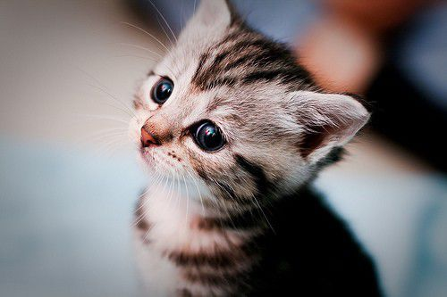

## Hello! Welcome to Yuqi's website

_Let me tell you something about me..._

My name is Yuqi Wang, a MPH candidate at Columbia University.

I love kitty!!!

For more information, please go to [About Me](about_me.html).

## Guidance for this website

From this website, you can learn something about me. On top right site, I include some information about **my resume, my email, my github and my linkedin**. Also, since this is the website for homework, you may also find a link for the Dashboard in next sections. I will try to input more things in the website in the future.

## Link to page within the site

If you would like to look at my brief resume, please go to [About Me](about_me.html).

If you are interested in the dashboard I made for the `rnoaa` dataset, please go to [Dashboard](dashboard.html).

